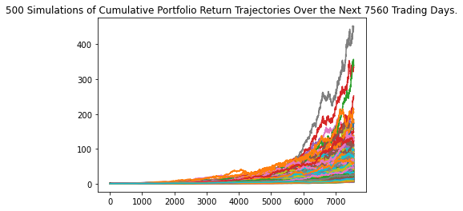
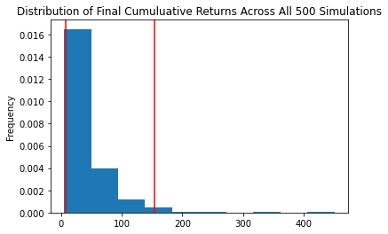

# Financial Planning Tools

This Jupyter Notebook is divided into two financial planning tools.

One evaluates the value of a prototype clients crypto wallet and current stock and bond portfolio in order to determine if the client has enough money in their emergency fund.

The second uses Monte Carlo simulations to determine whether the prototype client will have enough money to retire from their current investments in 30 years with a 60/40 portfolio split and in 10 years with an 80/20.

The results are then plotted as shown:




And shown as a distribution as follows:




The simulations use an API call via the Alpaca SDK to get 3 years of historical closing prices 


## Technologies
This notebook requires:

<a href="https://alpaca.markets/">Alpaca API</a>
<br><br>

<a href="https://alternative.me/crypto/api/">Free Crypto API</a>
<br><br>


In order to use this notebook you must create a .env file and include your Alpaca Keys


```
conda install -c anaconda requests
```


<br>This notebook requires Jupyter lab
<br>Installation:
```
pip install jupyterlab
````

This applications uses pandas<br>


```
pip install pandas
```
This application uses Pathlib<br>
```
pip install pathlib
```

This application uses NumPy<br>
```
pip install numpy
```

This application uses matplotlib<br>
```
pip install matplotlib
```
This application uses os<br>
```
pip install os
```

This application uses requests<br>
```
conda install -c anaconda requests
```
This application uses json<br>
```
conda install -c jmcmurray json
```


## Contributors

Brought to you by Rachel Bates.

---

## License

MIT
